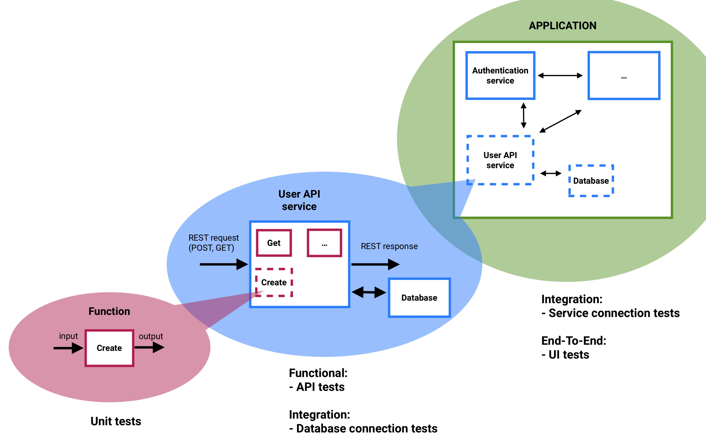
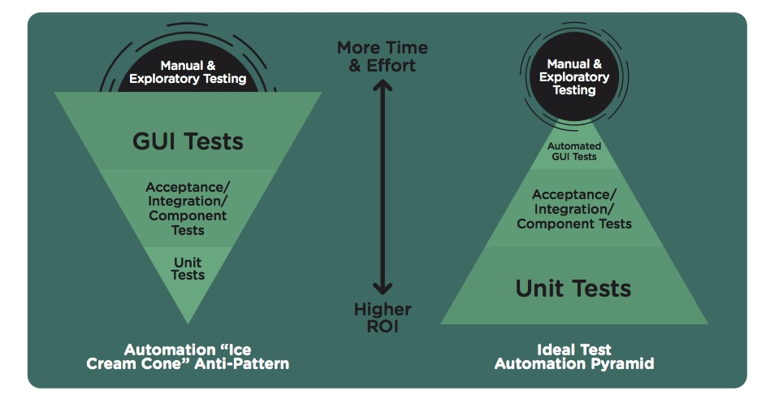
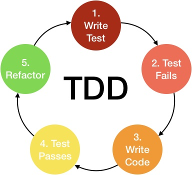

# Continuous testing

Continuous Testing is the process of executing automated tests as part of the software delivery pipeline to obtain feedback on the business risks associated with a software release candidate as rapidly as possible.

## Benefits

- Better efficiency and higher-quality deployments
- Rapid error discovery and remediation for distributed projects
- Improved user experience
- Minimization or elimination of business disruption and its costs

[Read more](https://www.ibm.com/cloud/learn/continuous-testing)

## Types of tests

**Unit tests:**

- The lowest level of testing
- Test an individual unit (or function) of a software
- Tests are run in very controlled environments
- 90-100% test coverage

**Functional:**

- Higher-level function testing
- Test outside dependencies
- Example: get a specific value from a database, API

**Integration:**

- Assemble project modules
- Test how microservices work together
- Example: database connection

**End-To-End:**

- Test the application in a real environment
- Use a production-like database
- UI testing
- Acceptance testing

## Example

## Test coverage

## Test-driven development (TDD)

## TDD benefits

- Better program design and higher code quality
- Detailed project documentation
- Reduces the time required for project development
- Code flexibility and easier maintenance
- End up with a reliable solution

## Test automation

- Run tests on a server with the specific configuration specified in your tests
- Run the tests on different versions of the code
  - Condition for Pull Request merge
  - On each commit
- Run on your own server

## Test writing best practices

1. Unit test structure:
  - Setup
  - Execution
  - Validation
  - Cleanup
  
2. Avoid anti-patterns:
  - test case depending on the system state from the previous test
  - dependencies between test cases
  - don't inspect more than necessary
  - slow running tests

## References

- [What is continuous testing?](https://www.ibm.com/cloud/learn/continuous-testing)

## Resources

- [Obey the testing Goat!](https://www.obeythetestinggoat.com/pages/book.html#toc)

---

*The content of this document, including all text, images, and associated materials, is the exclusive property of Adaltas and is protected by applicable copyright laws. Unauthorized distribution, reproduction, or sharing of this content, in whole or in part, is strictly prohibited without the express written consent of the author(s). Any violation of this restriction may result in legal action and the imposition of penalties as prescribed by law.*
